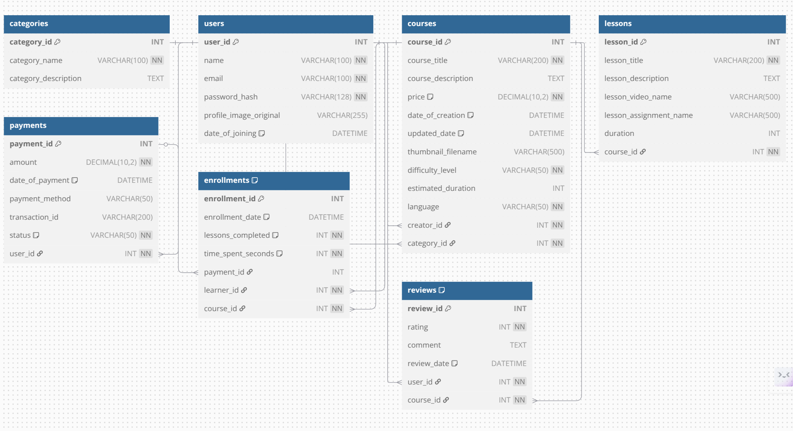

# Database Third Normal Form (3NF) Compliance Analysis

## 1. Introduction

This document analyzes the database schema designed for the SkillSphere Learning Management System (LMS) to verify its compliance with the Third Normal Form (3NF). Database normalization, particularly achieving 3NF, is a critical process in database design aimed at:

*   **Reducing Data Redundancy:** Minimizing the repetition of data across tables.
*   **Improving Data Integrity:** Ensuring data consistency and accuracy by reducing anomalies during data insertion, updates, or deletion.
*   **Simplifying Data Management:** Making the database structure more logical and easier to maintain.

This analysis will examine each table within the schema against the rules of normalization up to 3NF.

## 2. Definitions of Normal Forms

To understand 3NF, we must first define the preceding forms:

*   **First Normal Form (1NF):**
    1.  The table must have a primary key to uniquely identify each row.
    2.  All columns must contain atomic (indivisible) values.
    3.  There should be no repeating groups of columns.

*   **Second Normal Form (2NF):**
    1.  The table must already be in 1NF.
    2.  All non-key attributes (columns not part of the primary key) must be fully functionally dependent on the *entire* primary key. (This rule primarily addresses tables with composite primary keys, ensuring no non-key attribute depends only on *part* of the composite key).

*   **Third Normal Form (3NF):**
    1.  The table must already be in 2NF.
    2.  There must be **no transitive dependencies**. A transitive dependency exists when a non-key attribute depends on another non-key attribute, which in turn depends on the primary key. In simpler terms, every non-key attribute must depend *directly* on the primary key, and *only* on the primary key.

## 3. Schema Overview

The LMS database consists of the following primary tables (derived from the backend models):

1.  `categories`
2.  `users`
3.  `courses`
4.  `lessons`
5.  `payments`
6.  `enrollments`
7.  `reviews`

## 4. Table-by-Table 3NF Compliance Analysis

Each table will now be assessed based on the normalization rules.

### 4.1. `categories` Table

*   **Primary Key (PK):** `category_id`
*   **Non-Key Attributes:** `category_name`, `category_description`
*   **1NF Compliance:** Yes. `category_id` is the PK, and all columns hold atomic values. No repeating groups.
*   **2NF Compliance:** Yes. The PK is a single column, so all non-key attributes are automatically fully dependent on the entire PK.
*   **3NF Compliance:** Yes.
    *   `category_name` depends directly on `category_id` (it's the name of the category identified by the ID).
    *   `category_description` depends directly on `category_id` (it describes the category identified by the ID).
    *   There is no dependency between `category_name` and `category_description` (the description doesn't depend on the name itself, but on the category entity).
    *   **Conclusion:** No transitive dependencies exist.
*   **Verdict:** Complies with 3NF.

### 4.2. `users` Table

*   **Primary Key (PK):** `user_id`
*   **Non-Key Attributes:** `name`, `email`, `password_hash`, `profile_image_original`, `date_of_joining`
*   **1NF Compliance:** Yes. `user_id` is the PK, columns are atomic.
*   **2NF Compliance:** Yes. Single-column PK.
*   **3NF Compliance:** Yes.
    *   `name`, `email`, `password_hash`, `profile_image_original`, and `date_of_joining` all describe attributes of the specific user identified directly by `user_id`.
    *   None of these non-key attributes depend on any other non-key attribute within this table (e.g., `name` doesn't determine `email` or `date_of_joining`).
    *   **Conclusion:** No transitive dependencies exist.
*   **Verdict:** Complies with 3NF.

### 4.3. `courses` Table

*   **Primary Key (PK):** `course_id`
*   **Non-Key Attributes:** `course_title`, `course_description`, `price`, `date_of_creation`, `updated_date`, `thumbnail_filename`, `difficulty_level`, `estimated_duration`, `language`, `creator_id` (FK), `category_id` (FK)
*   **1NF Compliance:** Yes. `course_id` is PK, columns atomic.
*   **2NF Compliance:** Yes. Single-column PK.
*   **3NF Compliance:** Yes.
    *   All attributes (`course_title`, `description`, `price`, dates, `thumbnail_filename`, `difficulty_level`, `estimated_duration`, `language`) directly describe the specific course identified by `course_id`.
    *   The foreign keys `creator_id` and `category_id` also depend directly on `course_id` – they identify *which* creator made *this specific course* and *which* category *this specific course* belongs to.
    *   There are no functional dependencies between these non-key attributes (e.g., `price` doesn't depend on `language`; `difficulty_level` doesn't depend on `creator_id`).
    *   **Conclusion:** No transitive dependencies exist.
*   **Verdict:** Complies with 3NF.

### 4.4. `lessons` Table

*   **Primary Key (PK):** `lesson_id`
*   **Non-Key Attributes:** `lesson_title`, `lesson_description`, `lesson_video_name`, `lesson_assignment_name`, `duration`, `course_id` (FK)
*   **1NF Compliance:** Yes. `lesson_id` is PK, columns atomic.
*   **2NF Compliance:** Yes. Single-column PK.
*   **3NF Compliance:** Yes.
    *   `lesson_title`, `lesson_description`, `lesson_video_name`, `lesson_assignment_name`, and `duration` all directly describe the specific lesson identified by `lesson_id`.
    *   The foreign key `course_id` depends directly on `lesson_id` – it identifies *which* course *this specific lesson* belongs to.
    *   No non-key attributes depend on other non-key attributes (e.g., `duration` doesn't depend on `lesson_title`).
    *   **Conclusion:** No transitive dependencies exist.
*   **Verdict:** Complies with 3NF.

### 4.5. `payments` Table

*   **Primary Key (PK):** `payment_id`
*   **Non-Key Attributes:** `amount`, `date_of_payment`, `payment_method`, `transaction_id`, `status`, `user_id` (FK)
*   **1NF Compliance:** Yes. `payment_id` is PK, columns atomic.
*   **2NF Compliance:** Yes. Single-column PK.
*   **3NF Compliance:** Yes.
    *   `amount`, `date_of_payment`, `payment_method`, `transaction_id`, and `status` all directly describe attributes of the specific payment identified by `payment_id`.
    *   The foreign key `user_id` depends directly on `payment_id` – it identifies *which* user made *this specific payment*.
    *   No non-key attributes depend on other non-key attributes (e.g., `status` doesn't depend on `payment_method`).
    *   **Conclusion:** No transitive dependencies exist.
*   **Verdict:** Complies with 3NF.

### 4.6. `enrollments` Table

*   **Primary Key (PK):** `enrollment_id`
*   **Non-Key Attributes:** `enrollment_date`, `lessons_completed`, `time_spent_seconds`, `payment_id` (FK), `learner_id` (FK), `course_id` (FK)
*   **1NF Compliance:** Yes. `enrollment_id` is PK, columns atomic.
*   **2NF Compliance:** Yes. Single-column PK.
*   **3NF Compliance:** Yes.
    *   `enrollment_date`, `lessons_completed`, and `time_spent_seconds` directly describe the state or attributes of the specific enrollment identified by `enrollment_id`.
    *   The foreign keys `payment_id`, `learner_id`, and `course_id` depend directly on `enrollment_id` – they identify the associated payment (if any), the learner, and the course for *this specific enrollment event*.
    *   There are no dependencies between the non-key attributes (e.g., `lessons_completed` depends on the state of the enrollment `enrollment_id`, not directly on `learner_id` or `course_id` in a way that violates 3NF *within this table's structure*).
    *   **Conclusion:** No transitive dependencies exist.
*   **Verdict:** Complies with 3NF.

### 4.7. `reviews` Table

*   **Primary Key (PK):** `review_id`
*   **Non-Key Attributes:** `rating`, `comment`, `review_date`, `user_id` (FK), `course_id` (FK)
*   **1NF Compliance:** Yes. `review_id` is PK, columns atomic.
*   **2NF Compliance:** Yes. Single-column PK.
*   **3NF Compliance:** Yes.
    *   `rating`, `comment`, and `review_date` directly describe the specific review identified by `review_id`.
    *   The foreign keys `user_id` and `course_id` depend directly on `review_id` – they identify *which* user and *which* course *this specific review* pertains to.
    *   No non-key attributes depend on other non-key attributes (e.g., `comment` doesn't depend on `rating`).
    *   **Conclusion:** No transitive dependencies exist.
*   **Verdict:** Complies with 3NF.

## 5. Overall Conclusion

Based on the detailed analysis of each table (`categories`, `users`, `courses`, `lessons`, `payments`, `enrollments`, `reviews`) against the standard definitions of database normalization:

1.  All tables meet the requirements of the **First Normal Form (1NF)** by having a primary key, atomic values in columns, and no repeating groups.
2.  All tables meet the requirements of the **Second Normal Form (2NF)** as they are in 1NF, and since all primary keys are single columns, the condition of full functional dependency is automatically satisfied.
3.  All tables meet the requirements of the **Third Normal Form (3NF)** because they are in 2NF, and crucially, **no transitive dependencies** exist within any table. Every non-key attribute depends directly and solely on the primary key of its respective table.

Therefore, the database schema for the SkillSphere LMS application **is compliant with Third Normal Form (3NF)**. This design promotes data integrity, minimizes redundancy, and provides a solid, maintainable foundation for the application's data persistence layer.
